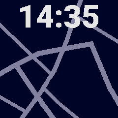

# Dexter Modern Map Example

**Note:** This example and its associated documentation is incomplete and has not been tested.

This watchface demonstrates Dexter's basic rendering and compositing capabilites as well as its ability to retrieve data from the host device (normally a phone). This example is well detailed and commented and takes advantage of some modern ES6 features.

The watchface makes heavy use of `dexter.ui.vectorCanvas` and functions within `dexter.host`. It relies on `dexter.ui.absoluteLayout` to place elements with pixel positions and makes use of alignment features to center them.

## Images

### Visualization

## Source Code
- [map.js](map.js) - Watchface code